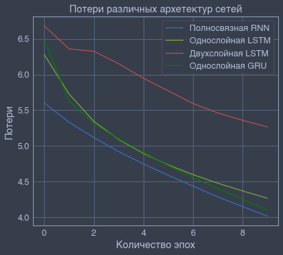

# Отчет по лабораторной работе "Генерация последовательностей"

### Москаленко Алексей Сергеевич, М8О-307Б
Номер в группе: 16, Вариант: 4 ((остаток от деления (4-1) на 6)+1)

### Цель работы
В данной лабораторной работе вам предстоит научиться генерировать последовательности с помощью рекуррентных нейронных сетей. В качестве последовательностей в зависимости выступает проза на английском языке, элемент последовательности - одно слово.

### Используемые входные данные

Несколько книг с сайта https://www.gutenberg.org

### Предварительная обработка входных данных

Для векторизации слов я скачал книги, удалил из них лишнюю информацию, после чего разбил текст на главы. Текст в главах я токенезировал, после чего с помощью Word2Vec технологии получил слова в векторном представлении вместе со словарем. 

Для того, чтобы получаемая последовательность была похожа на те, что производит человек, я решил не производить стэмминг и очистку от знаков препинаний и стоп-слов, что, конечно же идет во вред смысловой составляющей генерирумых последовательностей.

### Эксперимент 1: RNN

#### Архитектура сети

```
Model: "sequential"
_________________________________________________________________
Layer (type)                 Output Shape              Param #   
=================================================================
embedding (Embedding)        (128, None, 510)          5649270   
_________________________________________________________________
simple_rnn (SimpleRNN)       (128, None, 1024)         1571840   
_________________________________________________________________
dense (Dense)                (128, None, 11077)        11353925  
=================================================================
Total params: 18,575,035
Trainable params: 18,575,035
Non-trainable params: 0
_________________________________________________________________
```

#### Результат

Пример последовательности, сгенерированной сетью:
```
'I predict that it will be nothing here only workmen they should fourth predecessor good-bye standing beside me perfectly similarly grandson of late appeased that that stop at Bermondsey came into the swirling some blood; he paused brandy out of iron masterly coffin, and used playing “ door Peter Hawkins during experiences directly regarded'
```

### Эксперимент 2: Однослойная LSTM

#### Архитектура сети

```
Model: "sequential_1"
_________________________________________________________________
Layer (type)                 Output Shape              Param #   
=================================================================
embedding_1 (Embedding)      (128, None, 510)          5649270   
_________________________________________________________________
lstm (LSTM)                  (128, None, 1024)         6287360   
_________________________________________________________________
dense_1 (Dense)              (128, None, 11077)        11353925  
=================================================================
Total params: 23,290,555
Trainable params: 23,290,555
Non-trainable params: 0
_________________________________________________________________
```

#### Результат

Пример последовательности, сгенерированной сетью:
```
'I predict that it will be sadly position sternly done quickly contending matter. arches, and not help put? Much made developed gayety evident intimacy in every seventeenth tune or for the undertaker pallor, though several Magyars Goujon loves silk address wait uncommonly unpleasing. He stayed initial Maison 168 our enemy that going'
```

### Эксперимент 3: Двухслойная LSTM

#### Архитектура сети

```
Model: "sequential_2"
_________________________________________________________________
Layer (type)                 Output Shape              Param #   
=================================================================
embedding_2 (Embedding)      (128, None, 510)          5649270   
_________________________________________________________________
lstm_1 (LSTM)                (128, None, 1024)         6287360   
_________________________________________________________________
lstm_2 (LSTM)                (128, None, 1024)         8392704   
_________________________________________________________________
dense_2 (Dense)              (128, None, 11077)        11353925  
=================================================================
Total params: 31,683,259
Trainable params: 31,683,259
Non-trainable params: 0
_________________________________________________________________
```

#### Результат

Пример последовательности, сгенерированной сетью:
```
'I predict that it will be consecrated story should men redder agreed allow Germany that Elizabeth still cowered beats, pressed there again banishment indignation fathers her pall that of the shirt-sleeve home marriage is your party appears into relief home, a worship cried up of the Hôtel downfall slip came it and who while'
```

### Эксперимент 4: GRU

#### Архитектура сети

```
Model: "sequential_3"
_________________________________________________________________
Layer (type)                 Output Shape              Param #   
=================================================================
embedding_3 (Embedding)      (128, None, 510)          5649270   
_________________________________________________________________
gru (GRU)                    (128, None, 1024)         4718592   
_________________________________________________________________
dense_3 (Dense)              (128, None, 11077)        11353925  
=================================================================
Total params: 21,721,787
Trainable params: 21,721,787
Non-trainable params: 0
_________________________________________________________________
```

#### Результат

Пример последовательности, сгенерированной сетью:
```
'I predict that it will be overcome lived How flung to inquire ankles burghers survived “ must Derbyshire seemed rather handsome Doubtless 361 sent a tendency? If it. Betterment in those intimately canine wounded perpetual fighting 11 double men five paper presented to ever wanted kind to ask Zachary Whether abnormally lagged radicals copse'
```

#### График обучения  моделей:




### Подробное описание

Подробное описание выполненной работы можно изучить в [ноутбуке](lr.ipynb).


### Выводы

В результате мы получили 4 нейронных сети с рекуррентными слоями различных архитектур и посмотрели на то, как каждая из них генерирует последовательности слов и можем оценить насколько сгенерированные последовательности внешне похожи на те, которые производит человек.

Заметим, что все модели нашли некоторые закономерности в том, как грамматически построенны предложения, которые написаны человеком, однако результат нельзя назвать впечатляющим, поскольку то, что произвела модель всё еще далеко от настоящей человечесой письменности. Я думаю, что получил не самый оптимальный результат по той причине, что не достаточно аккуратно и тщательно обработал данные, использовал слишком простую архитектуру сетей, не сделал валидационную выборку для проверки качества на ней. Также, возможно что моя модель просто напросто переобучислась, чего я не обнаружил также из-за отсутствия выборки. Ситуацию могла исправить более точная подборка гиперпараметров, однако сделать это было проблематично, поскольку скорость обучения моделей была недостаточно велика, чтобы попробовать много различных параметров в короткий срок.
